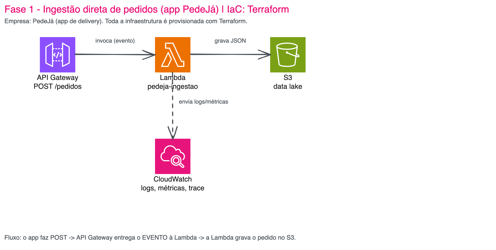
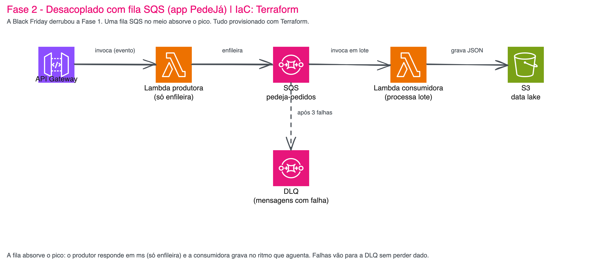
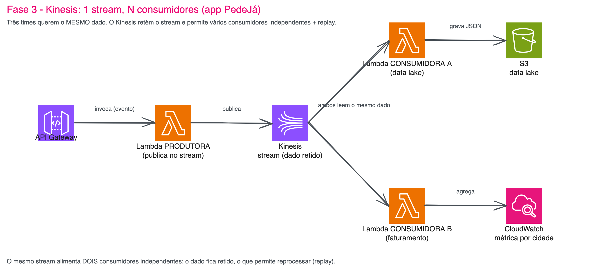

# 03.3 - Serverless: Lambda orientada a eventos (ingestao de dados)

**Antes de começar, execute os passos abaixo para configurar o ambiente caso não tenha feito isso ainda na aula de HOJE: [Preparando Credenciais](../../01-create-codespaces/Inicio-de-aula.md)**

Todos os comandos `bash`/`terraform` deste lab rodam no **terminal do GitHub Codespaces**. Os dashboards e traces são abertos no **console AWS** (sinalizado em cada passo).

> [!WARNING]
> **Pré-requisitos — confira antes de começar:**
>
> - [ ] Codespace aberto e sincronizado com credenciais da AWS Academy (rodou o [Preparando Credenciais](../../01-create-codespaces/Inicio-de-aula.md) na aula de hoje).
> - [ ] `aws sts get-caller-identity` retorna um `Account` e um `Arn` sem erro.
> - [ ] `aws s3 ls | grep base-config-` lista exatamente **um** bucket do seu RM.
> - [ ] `terraform -version` retorna >= 1.3.
> - [ ] Nenhuma Lambda `pedeja-*` existe ainda (`aws lambda list-functions --query "Functions[?starts_with(FunctionName,'pedeja')].FunctionName" --output text` retorna vazio).
>
> **O que você vai fazer:** provisionar com Terraform uma pipeline de ingestão de dados orientada a eventos em **três fases** (Lambda+S3 → SQS → Kinesis+Firehose), disparar os pedidos em cada fase (10 nas fases 1-2; **5.000** na fase 3), terminar lendo o data lake em **Parquet via Athena**, e usar **observabilidade** (logs, métricas e trace) para **decidir** quando evoluir a arquitetura. **Tempo estimado: 60-75 minutos** (execução pura ~30 min + tempo para ler, observar dashboards e refletir).

Neste laboratório você vive o dia a dia de um time de **engenharia de dados**: começa com uma ingestão simples que funciona, vê ela **quebrar sob pico**, e evolui a arquitetura **guiado por métricas** — não por achismo. Cada fase é um stack Terraform autossuficiente que você aplica, testa, observa e destrói antes de seguir.

## Principais pontos de aprendizagem

- Por que Lambda é **orientada a eventos**: o API Gateway entrega um *evento* à função; ela não é um servidor escutando porta.
- Quando uma ingestão síncrona (Lambda → S3) **não aguenta o pico** e por que desacoplar com **fila (SQS)** resolve.
- Quando a fila **não basta** e o problema pede **streaming (Kinesis)**: vários consumidores lendo o mesmo dado + reprocessamento (replay).
- Como entregar dados de streaming num data lake **analítico**: **Firehose** converte o stream em **Parquet** (Near Real Time) e o **Athena** consulta com SQL.
- Como instrumentar Lambda com **AWS Lambda Powertools** (log estruturado, métricas EMF, trace X-Ray).
- Como ler os **4 golden signals** (latência, tráfego, erros, saturação) e **métricas de negócio** para **justificar** uma evolução de arquitetura.

## O que você terá ao final

Três arquiteturas de ingestão funcionando e comparadas com dados reais, e a intuição de **qual escolher para cada situação** — defendida por dashboards que você mesmo observou, não por opinião.

> [!TIP]
> Ao longo do lab você vai encontrar blocos `<details><summary>💡 Clique para entender</summary>`. Eles aprofundam o "porquê". Se estiver com pressa, **pule**.

## Mapa do lab

| # | Parte | O que acontece | Passos | Tempo |
|---|-------|---------------|--------|-------|
| 1 | [O cenário: PedeJá](#parte-1---o-cenário-pedejá) | A história e o conjunto de dados fixo de pedidos. | [1](#passo-1) | ~5 min |
| 2 | [Fase 1 — Ingestão direta (Lambda → S3)](#parte-2---fase-1-ingestão-direta) | API GW → Lambda → S3. Funciona, observe os golden signals e destrua. | [2](#passo-2) · [3](#passo-3) · [4](#passo-4) · [5](#passo-5) · [6](#passo-6) · [7](#passo-7) · [8](#passo-8) | ~15 min |
| 3 | [Fase 2 — A Black Friday (SQS)](#parte-3---fase-2-a-black-friday) | O pico quebra a v1. Desacople com fila + DLQ e destrua. | [9](#passo-9) · [10](#passo-10) · [11](#passo-11) · [12](#passo-12) · [13](#passo-13) · [14](#passo-14) | ~15 min |
| 4 | [Fase 3 — Três times, um dado (Kinesis + Firehose + Athena)](#parte-4---fase-3-três-times-um-dado) | 5.000 pedidos. Firehose → Parquet → Athena, e faturamento em tempo real. Depois destrua. | [15](#passo-15) · [16](#passo-16) · [17](#passo-17) · [18](#passo-18) · [19](#passo-19) · [20](#passo-20) · [21](#passo-21) | ~20 min |
| 5 | [Conclusão e decisão](#parte-5---conclusão-e-decisão) | Tabela comparativa e o documento de decisão. | [22](#passo-22) | ~5 min |

> Os passos 3, 10 e 16 têm sub-passos (3.1/3.2 etc.) — clique no número para ir à parte. Os passos 8, 14 e 21 são o `terraform destroy` de cada fase: **não pule**.

> Se travou em algum passo, clique no número no mapa acima para ir direto a ele.

<details>
<summary><b>💡 O que é uma arquitetura "orientada a eventos" em 3 parágrafos (abra se nunca viu em aula)</b></summary>
<blockquote>

Uma **Lambda** não fica ligada esperando requisições como um servidor tradicional. Ela é **invocada por um evento**: alguém (API Gateway, SQS, Kinesis, S3, EventBridge...) entrega um pacote de dados e a AWS sobe a função, executa e desliga. Você paga só pelos milissegundos de execução. Por isso dizemos que é *event-driven*: o gatilho é sempre um evento, nunca uma porta aberta.

Isso muda a forma de pensar arquitetura de dados. Em vez de um processo único que recebe, valida e grava (e que cai inteiro quando uma parte falha), você compõe **peças pequenas conectadas por eventos**: uma função recebe, outra processa, um buffer no meio absorve picos. Cada peça escala e falha de forma independente.

Neste lab, o **mesmo** problema de negócio (ingerir pedidos da PedeJá) é resolvido de três formas, cada uma trocando *o que entrega o evento* para a Lambda: primeiro o API Gateway direto, depois uma fila SQS no meio, por fim um stream Kinesis. A diferença entre elas é exatamente o que separa um pipeline que cai na Black Friday de um que aguenta.

</blockquote>
</details>

## Contexto

A aula cobriu três modelos de execução na AWS: VM (EC2), container (ECS/Fargate) e função (**Lambda**). Os labs [03.1](../01-X86-Graviton/README.md) e [03.2](../02-ECS-Fargate/README.md) exploraram os dois primeiros. Aqui fechamos com o modelo **serverless** — e fazemos isso pela ótica da engenharia de dados, porque é onde a Lambda mais brilha: **ingestão orientada a eventos**.

O fio condutor é uma decisão de arquitetura que todo engenheiro de dados enfrenta: **começar simples e evoluir sob pressão de dados reais**. Você não vai adivinhar a arquitetura final — vai *medir* e deixar os números mandarem.

---

## Parte 1 - O cenário: PedeJá

> **Janeiro, segunda-feira de manhã.**
> Você é o novo engenheiro de dados da **PedeJá**, um app de delivery em expansão.
> A **Marina, líder de Dados**, te chama na primeira reunião:
>
> > *— "Cada pedido que entra no app precisa virar um registro no nosso data lake no S3.
> > Hoje a gente não captura nada. Começa simples: recebe o pedido, joga no S3. Topa?"*
>
> Parece trivial. E é — até a empresa crescer. Vamos construir a versão simples primeiro,
> e deixar os dados nos dizerem quando ela não serve mais.

### Resultado esperado desta parte

Você entende a história, o conjunto de dados fixo de pedidos, e a pergunta que vai nos acompanhar o lab inteiro.

<a id="passo-1"></a>
**1.** Conheça o conjunto de dados. Todo aluno usa **exatamente os mesmos 10 pedidos** — assim os resultados são idênticos para todos e você pode comparar com um colega. Abra e leia o arquivo:

```bash
cat /workspaces/fiap-cloud-engineering/03-Compute/03-Lambda/dados/pedidos.json | jq
```

São 10 pedidos, todos do dia `2026-03-15`, distribuídos em 4 cidades. Como o dado é fixo, o **faturamento por cidade é determinístico** — você vai usar isso para validar cada fase:

| Cidade | Pedidos | Faturamento esperado |
|--------|---------|----------------------|
| São Paulo | 4 | R$ 235,30 |
| Rio de Janeiro | 2 | R$ 198,40 |
| Curitiba | 2 | R$ 90,00 |
| Belo Horizonte | 2 | R$ 73,00 |
| **Total** | **10** | **R$ 596,70** |

> [!NOTE]
> Como cada pedido tem um `event_time` fixo (`2026-03-15`), todos os arquivos caem na **mesma partição** no S3 (`dt=2026-03-15`) — independente de quando você rodar o lab. Isso é proposital: garante que o resultado seja o mesmo para a turma toda.

**Pergunta-âncora do lab:** *"Qual foi o faturamento por cidade da PedeJá em 2026-03-15?"* — você vai respondê-la nas três fases, com arquiteturas diferentes, e o número tem que bater sempre.

### Checkpoint

- [x] Você lee u os 10 pedidos entendeu que o dataset é fixo.
- [x] Você sabe o faturamento esperado por cidade (vai usar para validar).

---

## Parte 2 - Fase 1: Ingestão direta

> *Marina: "Recebe e grava. Simples."* — Vamos construir a forma mais direta: o API Gateway
> entrega cada pedido como **evento** para uma Lambda, que grava no S3. Sem buffer, sem fila.

### Resultado esperado desta parte

Pipeline `API Gateway → Lambda → S3` no ar, os 10 pedidos gravados no data lake, e um dashboard mostrando os 4 golden signals + faturamento por cidade.



> Diagrama editável (Excalidraw): [`diagramas/fase-1.excalidraw`](diagramas/fase-1.excalidraw) — abra em [excalidraw.com](https://excalidraw.com).

<a id="passo-2"></a>
**2.** Entre na pasta da Fase 1 e inicialize o Terraform. O bucket de estado é descoberto automaticamente pelo prefixo `base-config-`:

```bash
cd /workspaces/fiap-cloud-engineering/03-Compute/03-Lambda/fase-1-ingestao
export bucket=$(aws s3 ls | awk '/base-config-/ {print $3; exit}')
echo "Bucket de estado: $bucket"
terraform init \
  -backend-config="bucket=$bucket" \
  -backend-config="key=compute/lambda/fase-1/terraform.tfstate" \
  -backend-config="region=us-east-1"
```

Se `Bucket de estado:` veio vazio, **pare** e revise o [Preparando Credenciais](../../01-create-codespaces/Inicio-de-aula.md).

<details>
<summary><b>💡 Clique para entender — por que a Lambda já é "event-driven" aqui</b></summary>
<blockquote>

A integração do API Gateway com a Lambda é do tipo `AWS_PROXY`: o API Gateway **monta um evento JSON** (com `body`, `headers`, etc.) e **invoca** a função com ele. A Lambda recebe esse evento em `event["body"]`, faz o trabalho e devolve. Ela não abre porta, não fica escutando — é acordada pelo evento e dorme depois. Esse é o coração do modelo serverless, e o motivo de pagarmos só pelos milissegundos de execução.

</blockquote>
</details>

<a id="passo-3"></a>
**3.1.** Aplique a infraestrutura (usamos `-auto-approve` em todos os labs para pular o "type yes"):

```bash
terraform apply -auto-approve
```

Ao final, o Terraform imprime 3 saídas (`api_url`, `bucket_datalake`, `dashboard_url`).


**3.2.** Em vez de copiar e colar a URL, capture os valores em variáveis de ambiente — os próximos passos usam `$API` e `$BUCKET`, então **rode na mesma pasta `fase-1-ingestao`**:

```bash
export API=$(terraform output -raw api_url)
export BUCKET="pedeja-datalake-$(aws sts get-caller-identity --query Account --output text)"
echo "API....: $API"
echo "BUCKET.: $BUCKET"
```

O `$API` vem do output do Terraform; o `$BUCKET` é montado a partir do ID da sua conta (o nome do bucket é sempre `pedeja-datalake-<sua-conta>`).

> [!TIP]
> Essas variáveis valem enquanto o terminal estiver aberto. Se você fechar o terminal ou abrir outro, rode de novo o passo 3.2 (de dentro da pasta da fase) para recriá-las.

<details>
<summary><b>⚠ Se der erro: <code>InvalidAccessKeyId</code> ou <code>ExpiredToken</code></b></summary>
<blockquote>
As credenciais da AWS Academy expiraram (duram 4 horas). Volte ao [Preparando Credenciais](../../01-create-codespaces/Inicio-de-aula.md), cole credenciais novas e rode `terraform apply -auto-approve` de novo.
</blockquote>
</details>

<a id="passo-4"></a>
**4.** Dispare os 10 pedidos contra a API. Este comando lê o dataset fixo e faz um `POST` por pedido, usando a variável `$API` capturada no passo 3.2:

```bash
cd /workspaces/fiap-cloud-engineering/03-Compute/03-Lambda
for p in $(seq 0 9); do
  pedido=$(python3 -c "import json;print(json.dumps(json.load(open('dados/pedidos.json'))[$p]))")
  curl -s -X POST "$API/pedidos" -H "Content-Type: application/json" -d "$pedido"
  echo ""
done
```

Saída esperada: 10 linhas como `{"status": "gravado", "s3_key": "pedidos/dt=2026-03-15/PED-0001.json"}`.

<details>
<summary><b>⚠ Se der erro: <code>curl</code> reclama de URL vazia ou <code>$API</code> não definida</b></summary>
<blockquote>
Você provavelmente abriu um terminal novo (as variáveis se perdem). Volte à pasta `fase-1-ingestao` e rode de novo o passo 3.2 (`export API=...` / `export BUCKET=...`).
</blockquote>
</details>

<a id="passo-5"></a>
**5.** Confirme que os 10 pedidos chegaram ao data lake — este é o **go/no-go** da fase. Usa a variável `$BUCKET` do passo 3.2. Se não der 10, pare e revise antes de seguir:

```bash
aws s3 ls s3://$BUCKET/pedidos/dt=2026-03-15/ | wc -l
```

Saída esperada: `10`.


<a id="passo-6"></a>
**6.** Pegue o link do **dashboard de observabilidade** (rode na pasta `fase-1-ingestao`) e abra no navegador:

```bash
terraform -chdir=/workspaces/fiap-cloud-engineering/03-Compute/03-Lambda/fase-1-ingestao output -raw dashboard_url && echo
```

Abra a URL impressa — ou vá direto pelo link **[CloudWatch → Dashboards → PedeJa-Fase1-Ingestao](https://us-east-1.console.aws.amazon.com/cloudwatch/home?region=us-east-1#dashboards/dashboard/PedeJa-Fase1-Ingestao)**. Observe os **4 golden signals** da Lambda e o **faturamento por cidade**.


<details>
<summary><b>💡 Clique para entender — os 4 golden signals (e por que eles guiam a evolução)</b></summary>
<blockquote>

Os **4 golden signals** (do livro de SRE do Google) são o mínimo para saber se um serviço está saudável:

| Signal | No dashboard | O que indica |
|--------|--------------|--------------|
| **Latência** | `Duration` (avg/p99) | quanto a Lambda demora por pedido |
| **Tráfego** | `Invocations` | quantos pedidos por minuto |
| **Erros** | `Errors` | quantas execuções falharam |
| **Saturação** | `ConcurrentExecutions` | quão perto do limite de concorrência você está |

Nesta Fase 1, com 10 pedidos, tudo está verde. Guarde a imagem mental: **saturação baixa, zero erros**. Na Fase 2 vamos provocar um pico e ver esses números mudarem — e é isso que vai *justificar* a próxima arquitetura.

O `valor_pedido` por cidade é uma **métrica de negócio**, emitida pela própria Lambda via **EMF (Embedded Metric Format)**: a função escreve uma linha de log estruturada e o CloudWatch a transforma em métrica, sem precisar de permissão extra. É assim que dados de negócio e de infra convivem no mesmo painel.

</blockquote>
</details>

<a id="passo-7"></a>
**7.** Veja o **log estruturado** que a Lambda emitiu — é onde a observabilidade fica visível no Learner Lab. Cada pedido virou uma linha JSON pesquisável, com o `xray_trace_id` (o id do trace distribuído), o `function_request_id`, `cold_start` e os dados de negócio:

```bash
aws logs filter-log-events \
  --log-group-name "/aws/lambda/pedeja-ingestao" \
  --start-time $(python3 -c "import time;print(int((time.time()-3600)*1000))") \
  --filter-pattern '"pedido gravado"' \
  --query "events[0].message" --output text | head -1 | python3 -m json.tool
```

Saída esperada (uma linha por pedido; repare no `xray_trace_id` e no `cold_start`):

```json
{
    "level": "INFO",
    "message": "pedido gravado",
    "service": "pedeja-ingestao",
    "cold_start": true,
    "function_request_id": "ccf1723b-...",
    "pedido_id": "PED-0001",
    "s3_key": "pedidos/dt=2026-03-15/PED-0001.json",
    "cidade": "Sao Paulo",
    "valor": 89.9,
    "xray_trace_id": "1-6a3fd4bb-6a2825535738b6f4095cb776"
}
```

<!-- PRINT SUGERIDO: img/f1-log.png
     Saida do filter-log-events mostrando o JSON do log estruturado com xray_trace_id e cold_start. -->


<details>
<summary><b>⚠ Se der erro: <code>Expecting value: line 1 column 1 (char 0)</code></b></summary>
<blockquote>

O `filter-log-events` não achou nenhum log na janela de tempo (o `python3 -m json.tool` recebeu texto vazio). Quase sempre é porque passou da janela ou os logs ainda não apareceram. Faça:

1. Rode o **passo 4** de novo (dispara os 10 pedidos) e aguarde ~30 segundos — o CloudWatch leva alguns segundos para indexar.
2. Repita este passo. Se ainda vier vazio, confirme que a Lambda existe e tem logs:

```bash
aws logs describe-log-streams --log-group-name "/aws/lambda/pedeja-ingestao" --order-by LastEventTime --descending --max-items 1 --query "logStreams[0].lastEventTimestamp"
```

Se isso retornar `None`, a Lambda ainda não foi invocada nenhuma vez — volte ao passo 4.

</blockquote>
</details>

> [!TIP]
> Prefere ver no console? Abra o log group direto neste link: **[CloudWatch Logs → /aws/lambda/pedeja-ingestao](https://us-east-1.console.aws.amazon.com/cloudwatch/home?region=us-east-1#logsV2:log-groups/log-group/$252Faws$252Flambda$252Fpedeja-ingestao)** (clique no log stream mais recente para ver as linhas JSON).

<details>
<summary><b>💡 Clique para entender — o <code>xray_trace_id</code> e o trace distribuído</b></summary>
<blockquote>

Cada requisição que entra pelo API Gateway recebe um **trace id** único (o `xray_trace_id`). Ele acompanha o pedido por todos os saltos (`API Gateway → Lambda → S3`), e o **Powertools Tracer** carimba esse id em todo log da execução. É assim que, em produção, você "puxa o fio" de um pedido específico através de vários serviços: filtra os logs por aquele `xray_trace_id` e vê tudo que aconteceu com ele.

O `cold_start: true` indica que essa foi a primeira invocação (a AWS teve que subir o ambiente da função); nas seguintes ele vira `false` e a latência cai. É um dos motivos de a Lambda ser orientada a eventos: ela dorme e acorda sob demanda.

</blockquote>
</details>

<details>
<summary><b>⚠ Se quiser o mapa visual do X-Ray (service map)</b></summary>
<blockquote>

O X-Ray **coleta** os traces (o tracing está ativo na Lambda), mas a conta do **AWS Academy Learner Lab não dá permissão** para a sua identidade abrir o *service map* / a lista de traces no console — você verá um banner vermelho de "não autorizado". Isso é um limite do Academy, não um erro seu.

Link (só funciona em conta AWS comum, no Academy mostra o banner): **[CloudWatch → X-Ray traces](https://us-east-1.console.aws.amazon.com/cloudwatch/home?region=us-east-1#xray:traces/query)**. Lá apareceria o fluxo `API Gateway → Lambda → S3` com o tempo de cada salto. No lab, a observabilidade vem pelos **logs** (acima) e pelo **dashboard** (passo 6).

</blockquote>
</details>

<a id="passo-8"></a>
**8.** A Fase 1 **funciona** e está observável. Antes de seguir, **destrua** esta fase para liberar os recursos (cada fase é independente e recria o que precisa):

```bash
cd /workspaces/fiap-cloud-engineering/03-Compute/03-Lambda/fase-1-ingestao
terraform destroy -auto-approve
```

> [!IMPORTANT]
> Não pule este passo. Cada fase é autossuficiente e recria o que precisa — deixar a fase anterior de pé só acumula recursos e custo na sua conta da AWS Academy.

### Checkpoint

- [x] `terraform apply` criou 8 recursos sem erro.
- [x] Os 10 pedidos aparecem no S3 em `pedidos/dt=2026-03-15/`.
- [x] Você viu os 4 golden signals e o faturamento por cidade no dashboard.
- [x] Você destruiu a Fase 1.

---

## Parte 3 - Fase 2: A Black Friday

> **Novembro, 20h de uma sexta-feira.**
> Black Friday. O app da PedeJá bombando. No dia seguinte, Marina te chama preocupada:
>
> > *— "Ontem no pico a gente perdeu pedido. O app reclamou que a API tava lenta e
> > alguns pedidos nem chegaram no S3. Não pode acontecer de novo."*
>
> O que aconteceu? Na Fase 1, o app **espera a Lambda gravar no S3** antes de receber o "ok".
> No pico, isso significa milhares de gravações simultâneas: a latência sobe, a concorrência
> satura e requisições começam a falhar. A gravação síncrona acoplou o app ao S3.
> **Vamos desacoplar com uma fila.**

### Resultado esperado desta parte

Pipeline `API Gateway → Lambda produtora → SQS → Lambda consumidora → S3`, com **DLQ** para falhas. O produtor responde em milissegundos (só enfileira) e a fila absorve o pico. Para ver isso de verdade, você vai simular o pico com **500 requisições** quase simultâneas.



> Diagrama editável (Excalidraw): [`diagramas/fase-2.excalidraw`](diagramas/fase-2.excalidraw) — abra em [excalidraw.com](https://excalidraw.com).

<a id="passo-9"></a>
**9.** Entre na pasta da Fase 2 e inicialize:

```bash
cd /workspaces/fiap-cloud-engineering/03-Compute/03-Lambda/fase-2-fila
export bucket=$(aws s3 ls | awk '/base-config-/ {print $3; exit}')
terraform init \
  -backend-config="bucket=$bucket" \
  -backend-config="key=compute/lambda/fase-2/terraform.tfstate" \
  -backend-config="region=us-east-1"
```

<a id="passo-10"></a>
**10.1.** Aplique. Agora são **duas** Lambdas (produtora e consumidora), a fila SQS e a DLQ:

```bash
terraform apply -auto-approve
```


**10.2.** Capture os valores em variáveis (rode na pasta `fase-2-fila`):

```bash
export API=$(terraform output -raw api_url)
export BUCKET="pedeja-datalake-$(aws sts get-caller-identity --query Account --output text)"
echo "API....: $API"
echo "BUCKET.: $BUCKET"
```

<details>
<summary><b>💡 Clique para entender — produtor, consumidor e por que a fila salva a Black Friday</b></summary>
<blockquote>

A diferença central: agora a Lambda que o app chama (**produtora**) faz **uma coisa só** — joga o pedido na fila e responde `202 Accepted` em milissegundos. Ela não toca no S3. Por isso aguenta o pico: enfileirar é barato e rápido.

Quem grava no S3 é a **consumidora**, disparada pelo SQS em **lotes** (até 10 mensagens por invocação). Se um lote falha, o SQS reentrega; após 3 tentativas (`maxReceiveCount = 3`), a mensagem vai para a **DLQ** (dead-letter queue) — uma fila separada onde você inspeciona o que deu errado, **sem perder o dado**.

A fila é um **buffer**: se chegam 10.000 pedidos num segundo, eles esperam na fila e a consumidora processa no ritmo que consegue. O app nunca trava. Esse é o padrão clássico de desacoplamento em engenharia de dados.

</blockquote>
</details>

<a id="passo-11"></a>
**11.** Simule o **pico**: dispare **500 pedidos** contra a API, usando a variável `$API` capturada no passo 10.2. O script cicla os 10 pedidos fixos (50 vezes) com IDs únicos `PED-0001..PED-0500` — então o resultado é determinístico (mesmos 500 objetos para todo aluno):

```bash
cd /workspaces/fiap-cloud-engineering/03-Compute/03-Lambda
python3 dados/publicar_500.py "$API"
```

Uma barra de progresso mostra o avanço em tempo real (`[####....] 40% 200/500 pedidos`). Saída final: `Concluido: 500/500 pedidos publicados em Ns`. Cada chamada respondeu `202 Accepted` (**`enfileirado`**, não `gravado`) — o produtor responde antes de o S3 ser tocado. É o desacoplamento absorvendo o pico: 500 requisições quase simultâneas entram na fila sem travar o app.

<a id="passo-12"></a>
**12.** Aguarde a consumidora drenar a fila e confirme que os 500 chegaram ao S3 (**go/no-go**). Usa a variável `$BUCKET` do passo 10.2:

```bash
sleep 20
aws s3 ls s3://$BUCKET/pedidos/dt=2026-03-15/ | wc -l
```

Saída esperada: `500`. A fila absorveu o pico e a consumidora gravou os 500 pedidos no data lake — de forma assíncrona, no ritmo dela. Se ainda não deu 500, espere mais alguns segundos e rode de novo (a consumidora pode estar terminando de processar os últimos lotes).


<a id="passo-13"></a>
**13.** Pegue o link do dashboard `PedeJa-Fase2-Fila` e abra no navegador:

```bash
terraform -chdir=/workspaces/fiap-cloud-engineering/03-Compute/03-Lambda/fase-2-fila output -raw dashboard_url && echo
```

Abra a URL impressa — ou vá direto pelo link **[CloudWatch → Dashboards → PedeJa-Fase2-Fila](https://us-east-1.console.aws.amazon.com/cloudwatch/home?region=us-east-1#dashboards/dashboard/PedeJa-Fase2-Fila)**. Com os 500 pedidos, agora dá para **ver o desacoplamento acontecer**: a **profundidade da fila** sobe (o backlog que entrou no pico) e depois zera conforme a consumidora drena; a **latência do produtor** fica baixíssima (só enfileira) contra a da **consumidora** (que grava no S3); e a **DLQ** segue vazia (nada falhou).


<a id="passo-14"></a>
**14.** A fila resolveu o pico. **Destrua** a Fase 2 antes de seguir:

```bash
cd /workspaces/fiap-cloud-engineering/03-Compute/03-Lambda/fase-2-fila
terraform destroy -auto-approve
```

> [!IMPORTANT]
> Não pule este passo. Deixar SQS, DLQ e Lambdas de pé acumula recursos e custo na sua conta da AWS Academy <b>caso utilizados</b>.

### Checkpoint

- [x] `terraform apply` criou 12 recursos (2 Lambdas, SQS, DLQ, API, dashboard).
- [x] Os 500 POSTs retornaram `enfileirado` (produtor desacoplado do S3).
- [x] Os 500 pedidos chegaram ao S3 via consumidora (`aws s3 ls ... | wc -l` = 500).
- [x] Você viu o backlog da fila subir e zerar, e a latência produtor vs consumidor no dashboard.
- [x] Você destruiu a Fase 2.

---

## Parte 4 - Fase 3: Três times, um dado

> **Meses depois.** A PedeJá cresceu. Três times batem à sua porta na mesma semana:
>
> > *— BI: "Preciso do faturamento por cidade em tempo real pro painel da diretoria."*
> > *— ML: "Quero ler todos os pedidos pra treinar o modelo de previsão de demanda."*
> > *— Antifraude: "Preciso **reprocessar** a última hora de pedidos quando um padrão novo aparece."*
>
> Todos querem **o mesmo dado**, ao mesmo tempo, de formas diferentes. E a fila SQS **não faz isso**:
> quando uma mensagem é lida, ela some — um consumidor só. E não dá pra "reler" o passado.
> Esse é o ponto em que a fila vira streaming. **Vamos para o Kinesis.**

Agora o volume também é real: você vai publicar **5.000 pedidos** (não mais 10) — é o que faz a diferença entre fila e streaming aparecer de verdade.

### Resultado esperado desta parte

Pipeline `API Gateway → Lambda produtora → Kinesis → 2 consumidores independentes`, lendo o **mesmo** stream sem disputar o dado:

- **Consumidor A — Kinesis Firehose**: acumula um micro-lote (60s), converte para **Parquet** e grava no S3. Você consulta com **Athena** em SQL, Near Real Time (≤ 1 min após publicar).
- **Consumidor B — Lambda de faturamento**: agrega o faturamento por cidade em tempo real (métrica no CloudWatch).



> Diagrama editável (Excalidraw): [`diagramas/fase-3.excalidraw`](diagramas/fase-3.excalidraw) — abra em [excalidraw.com](https://excalidraw.com).

<a id="passo-15"></a>
**15.** Entre na pasta da Fase 3 e inicialize:

```bash
cd /workspaces/fiap-cloud-engineering/03-Compute/03-Lambda/fase-3-streaming
export bucket=$(aws s3 ls | awk '/base-config-/ {print $3; exit}')
terraform init \
  -backend-config="bucket=$bucket" \
  -backend-config="key=compute/lambda/fase-3/terraform.tfstate" \
  -backend-config="region=us-east-1"
```

<a id="passo-16"></a>
**16.1.** Aplique. Agora são 2 Lambdas (produtora + faturamento), o Kinesis Data Stream, o **Firehose** (Consumidor A), uma tabela no **Glue Data Catalog** e o data lake — 14 recursos no total:

```bash
terraform apply -auto-approve
```

**16.2.** Capture os valores em variáveis (rode na pasta `fase-3-streaming`):

```bash
export API=$(terraform output -raw api_url)
export BUCKET="pedeja-datalake-$(aws sts get-caller-identity --query Account --output text)"
echo "API....: $API"
echo "BUCKET.: $BUCKET"
```

> [!NOTE]
> A Lambda de faturamento usa `starting_position = TRIM_HORIZON` (lê desde o início do stream) e leva ~30-60s para "armar". O **Firehose** entrega no S3 a cada **60 segundos** (buffer). Por isso, depois de publicar (passo 17), você espera ~1 min antes de consultar no Athena (passo 19).

<details>
<summary><b>💡 Clique para entender — por que Kinesis e não outra fila</b></summary>
<blockquote>

A diferença que justifica a migração SQS → Kinesis:

| Aspecto | Fila (SQS) | Streaming (Kinesis) |
|---------|------------|---------------------|
| Ao ser lida, a mensagem | **some** (1 consumidor) | **permanece** (N consumidores) |
| Vários consumidores do mesmo dado | não | **sim, independentes** |
| Reprocessar o passado (replay) | não | **sim** (dado retido, padrão 24h) |
| Ordenação | limitada | por shard (partition key) |
| Ideal para | desacoplar e absorver pico | distribuir o mesmo stream + reprocessar |

Cada consumidor tem seu **próprio ponteiro de leitura** (iterator) no stream. O time de BI e o de ML leem os mesmos registros sem um atrapalhar o outro. E como o dado fica retido, o antifraude pode **reprocessar** a última hora — algo impossível com a fila, onde o dado já foi consumido e descartado.

</blockquote>
</details>

<details>
<summary><b>💡 Clique para entender — por que Firehose + Parquet (e não uma Lambda gravando arquivo por pedido)</b></summary>
<blockquote>

Na Fase 1 cada pedido virou um arquivo JSON no S3. Com 5.000 pedidos isso seriam 5.000 arquivos minúsculos — o clássico **problema de "small files"**, que deixa qualquer query lenta e cara.

O **Kinesis Data Firehose** resolve isso: ele lê o stream, **acumula um micro-lote** (aqui: a cada 60s ou 64 MB, o que vier primeiro) e grava **um** arquivo já em **Parquet** — formato colunar, comprimido, feito para análise. A conversão usa o schema da tabela no **Glue Data Catalog**, e é essa mesma tabela que o **Athena** consulta. Resultado: poucos arquivos grandes, leitura barata, SQL em segundos. É o padrão moderno de ingestão de data lake (*Near Real Time*), sem você gerenciar servidor nenhum.

</blockquote>
</details>

<a id="passo-17"></a>
**17.** Publique **5.000 pedidos** no stream, usando a variável `$API` do passo 16.2. O script cicla os 10 pedidos fixos (500 vezes) com IDs únicos `PED-0001..PED-5000` — então o faturamento por cidade é exatamente **500× o da Parte 1** (determinístico):

```bash
cd /workspaces/fiap-cloud-engineering/03-Compute/03-Lambda
python3 dados/publicar_5000.py "$API"
```

Uma barra de progresso mostra o avanço em tempo real (`[########....] 60% 3000/5000 pedidos (ok: 3000, ...)`). Saída final (leva ~1-2 min): `Concluido: 5000/5000 pedidos publicados em Ns`.

<details>
<summary><b>⚠ Se der erro: alguns pedidos falharam (ex.: <code>4998/5000</code>)</b></summary>
<blockquote>
Throttling pontual da API sob carga. Rode o comando de novo — os IDs são os mesmos (`PED-0001..PED-5000`), então republicar não duplica no resultado final por `pedido_id`, e o Firehose simplesmente recebe os que faltaram.
</blockquote>
</details>

<a id="passo-18"></a>
**18.** Valide o **Consumidor B (Lambda de faturamento)** — ele agrega as 4 cidades em tempo real, lendo o mesmo stream:

```bash
sleep 30
aws logs filter-log-events --log-group-name "/aws/lambda/pedeja-faturamento" \
  --start-time $(python3 -c "import time;print(int((time.time()-300)*1000))") \
  --filter-pattern '"faturamento agregado"' --query "events[].message" --output text \
  | grep -o '"cidade":"[^"]*"' | sort -u
```

Saída esperada: as 4 cidades — `Belo Horizonte`, `Curitiba`, `Rio de Janeiro`, `Sao Paulo`.

<a id="passo-19"></a>
**19.** Valide o **Consumidor A (Firehose → Parquet → Athena)**. Espere o buffer do Firehose fechar (~60s) e consulte com SQL. Este é o **go/no-go** da fase — o número tem que bater com a Parte 1 × 500:

```bash
sleep 60
aws athena start-query-execution \
  --query-string "SELECT cidade, COUNT(*) AS pedidos, ROUND(SUM(valor),2) AS faturamento FROM pedeja.pedidos GROUP BY cidade ORDER BY faturamento DESC" \
  --query-execution-context Database=pedeja \
  --result-configuration "OutputLocation=s3://$BUCKET/athena-results/" \
  --query "QueryExecutionId" --output text
```

Esse comando devolve um **ID de execução**. Pegue o resultado (troque `<ID>` pelo valor impresso):

```bash
aws athena get-query-results --query-execution-id <ID> \
  --query "ResultSet.Rows[].Data[].VarCharValue" --output text
```

Saída esperada (o faturamento é 500× o da Parte 1):

| Cidade | Pedidos | Faturamento |
|--------|---------|-------------|
| São Paulo | 2000 | 117650.0 |
| Rio de Janeiro | 1000 | 99200.0 |
| Curitiba | 1000 | 45000.0 |
| Belo Horizonte | 1000 | 36500.0 |
| **Total** | **5000** | **298350.0** |

<!-- PRINT SUGERIDO: img/f3-athena.png
     Resultado da query no Athena: 4 cidades com 5000 pedidos no total e faturamento 500x. Pode ser no console do Athena (mais visual) ou no terminal. -->


> [!TIP]
> Prefere o console? Abra o **[Athena Query Editor](https://us-east-1.console.aws.amazon.com/athena/home?region=us-east-1#/query-editor)**, selecione o database `pedeja` e rode a mesma query. Na primeira vez o Athena pede para configurar um local de resultados — use `s3://<seu-bucket>/athena-results/`.

<details>
<summary><b>⚠ Se der erro: <code>0 pedidos</code> ou tabela vazia no Athena</b></summary>
<blockquote>
O Firehose ainda não fechou o buffer (60s). Espere mais ~30s e rode a query de novo. Confirme que já há Parquet no S3 com: `aws s3 ls s3://$BUCKET/pedidos/ --recursive | grep -c parquet` (tem que ser ≥ 1).
</blockquote>
</details>

<a id="passo-20"></a>
**20.** Pegue o link do dashboard `PedeJa-Fase3-Streaming` e abra no navegador:

```bash
terraform -chdir=/workspaces/fiap-cloud-engineering/03-Compute/03-Lambda/fase-3-streaming output -raw dashboard_url
```

Abra a URL impressa — ou vá direto pelo link **[CloudWatch → Dashboards → PedeJa-Fase3-Streaming](https://us-east-1.console.aws.amazon.com/cloudwatch/home?region=us-east-1#dashboards/dashboard/PedeJa-Fase3-Streaming)**. Você vê **publicados (5000) vs entregue ao S3 em Parquet (Firehose)** convergindo, e o **data freshness** do Firehose (quantos segundos o dado levou para chegar ao S3 — perto de 60s).

<!-- PRINT SUGERIDO: img/f3-dashboard.png
     Dashboard PedeJa-Fase3-Streaming: publicados vs entregue em Parquet, data freshness do Firehose e faturamento por cidade. -->


<a id="passo-21"></a>
**21.** Destrua a Fase 3:

```bash
cd /workspaces/fiap-cloud-engineering/03-Compute/03-Lambda/fase-3-streaming
terraform destroy -auto-approve
```

> [!CAUTION]
> **Esse passo não é opcional.** Kinesis on-demand, Firehose e Lambdas geram custo enquanto vivos — se você sair sem destruir, segue consumindo o orçamento da sua conta da AWS Academy.

### Checkpoint

- [x] `terraform apply` criou Kinesis + Firehose + Glue + 2 Lambdas.
- [x] Os 5.000 pedidos foram publicados no stream.
- [x] Consumidor A: o Athena lê o Parquet e o faturamento bate (R$ 298.350,00 em 5000 pedidos).
- [x] Consumidor B: a Lambda agregou as 4 cidades — do mesmo stream.
- [x] Você destruiu a Fase 3.

---

## Parte 5 - Conclusão e decisão

Você resolveu o **mesmo** problema de negócio três vezes, e cada arquitetura respondeu bem a uma pergunta diferente:

| | Fase 1 — Lambda → S3 | Fase 2 — SQS | Fase 3 — Kinesis + Firehose |
|---|---|---|---|
| **Problema que resolve** | ingestão simples | absorver pico sem perder dado | distribuir o mesmo dado + replay + análise |
| **Responde bem** | volume baixo e estável | rajada/Black Friday | vários consumidores; 5.000+ em Parquet, SQL no Athena |
| **Responde mal** | satura no pico (síncrono) | 1 consumidor, sem replay | excesso para volume baixo |
| **Acontece na vida real quando** | MVP, protótipo | e-commerce com sazonalidade | dado consumido por BI (Athena) + ML + fraude |

A lição central de engenharia de dados: **não existe arquitetura "certa" no vácuo**. A Fase 1 não é "errada" — ela é a escolha certa enquanto o volume é baixo. O que mudou foi o *problema*, e os **dados de observabilidade** (latência subindo, saturação, depois a necessidade de múltiplos consumidores) é que justificaram cada evolução. Você não adivinhou: mediu.

<a id="passo-22"></a>
**22.** Escreva sua decisão. Crie um arquivo `DECISION.md` na pasta do lab respondendo, em poucas linhas, como se fosse para a Marina:

```bash
code /workspaces/fiap-cloud-engineering/03-Compute/03-Lambda/DECISION.md
```

Use este template:

```markdown
# Decisão de arquitetura — Ingestão de pedidos PedeJá

## Contexto
(qual o volume e os consumidores do dado hoje?)

## Decisão
(qual das 3 arquiteturas você escolheria HOJE para a PedeJá, e por quê?)

## Sinais que me fariam evoluir
(quais métricas, e em que limite, me fariam migrar para a próxima fase?)

## Consequências
(o que essa escolha facilita e o que ela dificulta?)
```

> [!TIP]
> Saber **escrever sobre a decisão** vale tanto quanto saber implementá-la. Em entrevistas sênior de engenharia de dados, "por que você escolheu X e não Y, e o que te faria mudar de ideia" é a pergunta que separa júnior de sênior.

### Checkpoint

- [x] As três fases estão **destruídas** (rode `aws lambda list-functions --query "Functions[?starts_with(FunctionName,'pedeja')].FunctionName" --output text` — deve vir vazio).
- [x] Você escreveu seu `DECISION.md`.

---

## Conclusão

Você construiu, do zero e com Terraform, três pipelines serverless de ingestão de dados, cada uma orientada a eventos, e usou observabilidade real (logs estruturados, métricas EMF de negócio, 4 golden signals e trace X-Ray, tudo via AWS Lambda Powertools) para **decidir com dados** quando evoluir de uma ingestão direta para fila e depois para streaming. Mais importante que os serviços: você praticou o raciocínio de **deixar as métricas guiarem a arquitetura**.

---

<details>
<summary><b>💡 Glossário rápido</b></summary>
<blockquote>

| Termo | O que é |
|-------|---------|
| Lambda | Função serverless: é invocada por um evento, executa e desliga; paga-se por ms. |
| Event-driven | Arquitetura em que cada peça é acionada por um evento, não por uma porta aberta. |
| API Gateway | Porta de entrada HTTP; na integração `AWS_PROXY` entrega a requisição como evento à Lambda. |
| SQS | Fila gerenciada; desacopla produtor e consumidor; cada mensagem é lida por 1 consumidor e some. |
| DLQ | Dead-letter queue: fila para mensagens que falharam N vezes, para inspeção sem perda. |
| Kinesis Data Stream | Streaming: dado fica retido, lido por N consumidores independentes, permite replay. |
| Kinesis Data Firehose | Entrega gerenciada de streaming: acumula micro-lote e grava no S3, convertendo para Parquet. |
| Parquet | Formato de arquivo colunar e comprimido, padrão para análise (lê só as colunas que a query precisa). |
| Glue Data Catalog | Catálogo de metadados (databases/tabelas) que descreve o schema dos dados no S3. |
| Athena | Consulta SQL serverless sobre arquivos no S3 (usa o schema do Glue); paga por dado escaneado. |
| Near Real Time | Dado disponível para consulta poucos segundos/minutos após gerado (aqui: ~60s via Firehose). |
| Shard | Unidade de paralelismo/ordenação do Kinesis; a partition key define o shard. |
| TRIM_HORIZON | Posição de leitura que começa no início do stream (processa todo o retido). |
| Event source mapping | Liga uma fonte (SQS/Kinesis) a uma Lambda, fazendo o polling e a invocação em lote. |
| Powertools | Biblioteca AWS para Lambda: Logger (log estruturado), Metrics (EMF), Tracer (X-Ray). |
| EMF | Embedded Metric Format: log JSON que o CloudWatch converte em métrica, sem API extra. |
| Golden signals | Latência, tráfego, erros e saturação — o mínimo para avaliar a saúde de um serviço. |
| LabRole | Role IAM pré-criada do AWS Academy; usamos ela porque o Academy não deixa criar roles. |

</blockquote>
</details>

<details>
<summary><b>💡 Como pedir ajuda se travou</b></summary>
<blockquote>

**Antes de abrir issue ou chamar o professor, colete:**

1. Em qual passo (número) travou.
2. A mensagem de erro **literal** (copie e cole, não resuma).
3. O que `aws sts get-caller-identity` retorna agora.
4. Em qual fase você está (1, 2 ou 3) e se já tentou `terraform destroy` + `terraform apply` de novo.

**Canais, em ordem:**

1. [Issues deste repositório](https://github.com/vamperst/fiap-cloud-engineering/issues) — preferido, cria histórico pesquisável.
2. Email do professor com os 4 itens acima.
3. Na sala de aula, durante o laboratório.

</blockquote>
</details>
